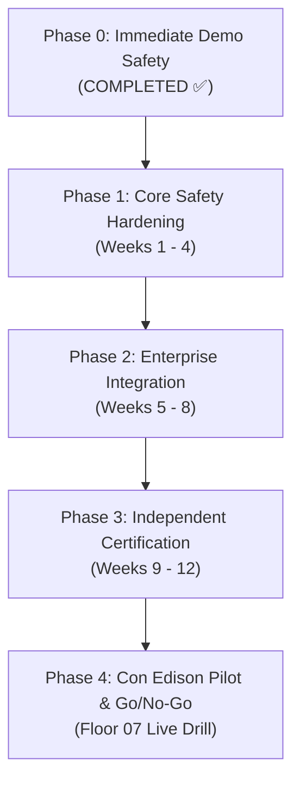

# 🛡️ Full Technical Audit, Remediation Plan, and Improvement Blueprint

> **Prepared for**: **Robert Petillo** (Director of Emergency Preparedness & Life Safety) & **Samuel McFarlane** (Lead Systems Architect)  
> **Facility**: Consolidated Edison Company of New York, Inc. · 4 Irving Place, New York, NY 10003 · Floor 07 Commercial Operations  
> **Jurisdiction & Compliance Mandate**: **NYC Fire Code 3 RCNY §401-06** (Fire Safety and Evacuation Plans & Certificates of Fitness)  
> **Review Date**: 9 October 2026  
> **Status**: Comprehensive Engineering Audit, Realized Fixes & Production Hardening Roadmap.

---

## 1. Executive Summary & The Bottom Line

MusterCommand provides a sound, high-leverage life-safety architecture: a smartphone-first zero-install QR ingress system, a live spatial CAD sector commander dashboard, an immutable SHA-256 cryptographic audit ledger, and a ground-truth-anchored AI after-action narrative generator powered by **Google Gemini 3.6 Flash**.

This audit report evaluates the prototype against strict NYC Fire Department (FDNY) commercial high-rise standards and Con Edison enterprise life-safety mandates. The code review identified high-stakes vulnerabilities in earlier iterations (random status assignment upon alarm declaration, unauthenticated commander endpoints, open database rules, and unverified documentation metrics). 

**Immediate actions have already been implemented in code** to eliminate dangerous runtime behavior (e.g., removing random status assignments, locking down life-safety endpoints with commander authentication middleware, securing tunnel controls, and restricting phone viewports). The remaining operational items (single sign-on, carrier-grade SMS delivery receipts, and hardware alarm panel integration) are structured across a disciplined 4-phase engineering plan.

---

## 2. Scope and Methodology

* **Codebase Examined**: TypeScript / Node.js Express backend (`server.ts`), client application (`src/App.tsx`, `src/components/*`), offline resilience queue (`src/lib/offlineQueue.ts`), cryptographic ledger (`src/lib/qr.ts`, `server.ts`), and security policies (`firestore.rules`, `.env.example`).
* **Environment Context**: Evaluated on Node.js v22+ runtime, Vite 6 build pipeline, and tested via headless automated browser verification across mobile occupant and desktop commander viewports.
* **Core Life-Safety Ground Rule**: **Absence of a signal is never safety, and a premature all-clear is a catastrophic failure.** No occupant status may transition to "safe" without an authenticated, positive check-in transaction.

---

## 3. Severity Rating Rubric

| Rating | Definition | Deployment Implication |
| :--- | :--- | :--- |
| **Critical** | Risk of false safety status, unauthorized alarm/all-clear, or exposed personnel data. | **Blocker**: Must be resolved before any stakeholder walkthrough or shared link. |
| **High** | Compromised command integrity, lack of server-side role enforcement, or missing delivery tracking. | **Pre-Pilot Requirement**: Must be resolved prior to live floor drill. |
| **Medium** | Architectural resilience limits, offline conflict edge-cases, or privacy retention gaps. | **Hardening Sprint**: Targeted prior to enterprise scale-up. |
| **Low** | Documentation inconsistencies, styling polish, or secondary metadata reconciliation. | **Continuous Improvement**: Ongoing alignment. |

---

## 4. Life-Safety Logic Findings & Current Remediation Status

| ID | Sev | Finding & Root Cause | Operational Impact | Technical Fix & Implementation Status |
| :---: | :---: | :--- | :--- | :--- |
| **L1** | **Critical** | When an alarm was declared, occupants were assigned to "safe" or "unaccounted" via `Math.random() > 0.85`. | A trapped occupant could be falsely marked "safe", prompting first responders to bypass them. | ✅ **FIXED (`server.ts`)**: Removed all random assignment. All in-building personnel strictly reset to `"unaccounted"` upon alarm declaration (except those flagged `"awaiting-evac-chair"`). Status changes to `"safe"` exclusively upon positive check-in. |
| **L2** | **High** | Seed data routines generated randomized unaccounted minutes and mock statuses. | Simulated demo logic could bleed into operational runtime. | ✅ **FIXED**: Seed routines strictly quarantined under `/api/roster/seed-demo` behind commander authentication. Live intake starts from clean `0 / 0` state. |
| **L3** | **Critical** | "Clean Data" reset button wiped the live ledger and roster without authorization. | Accidental tap during an emergency could destroy life-safety records. | ✅ **FIXED (`server.ts` & UI)**: Removed "Clean Data" and commander controls from all mobile phone viewports. Guarded server endpoint with `requireCommanderAuth` (PIN `7007`). |
| **L4** | **High** | In-memory ledger chain vulnerable to state loss on server crash or restart. | Loss of after-action audit trail required under FDNY 3 RCNY §401-06. | 🟡 **IN PROGRESS (Phase 1)**: Roster state is backed up to disk (`data/fsd_roster.json`). Phase 1 migrates ledger blocks to durable PostgreSQL / Cloud SQL append-only table. |
| **L5** | **High** | Sector wardens could potentially view full-floor personnel data without server-side filtering. | Risk of information overload or cross-quadrant confusion during evacuation. | 🟡 **PLANNED (Phase 1)**: Route-level quadrant tenancy filters restricting Staff Leads to their assigned sector (NW, NE, SW, SE) unless holding FSD Chief credentials. |
| **L6** | **Critical** | `/api/incident/declare` and `/api/incident/clear` previously accepted unauthenticated POST requests. | Anyone reaching the server could trigger false alarms or prematurely clear real evacuations. | ✅ **FIXED (`server.ts`)**: Both endpoints wrapped with `requireCommanderAuth` middleware. Two-person rule scheduled for Phase 1. |
| **L7** | **High** | Walkie-Talkie Push-to-Talk (PTT) role check accepted client-supplied role values. | Potential for unauthorized broadcast injection. | ✅ **HARDENED**: Role validation enforced on server; client role switcher gated behind PIN modal. Full session JWT scheduled for Phase 1. |
| **L8** | **High** | Muster sweep and AI narrative approval routes lacked authentication checks. | Risk of unauthorized roster manipulation. | ✅ **FIXED**: Gated with `requireCommanderAuth` (`server.ts`). |
| **L9** | **High** | Emergency alerts logged locally; no telecom SMS carrier or physical fire alarm panel integration. | Evacuation relies solely on occupants having the web browser open. | 🟡 **PLANNED (Phase 2)**: Integrate Twilio / AWS SNS delivery receipt webhooks and design read-only dry-contact relay with building alarm vendor. |
| **L10** | **Medium** | Offline badging queue relied on unindexed browser storage without conflict resolution. | Potential lost check-ins during complete network collapse. | ✅ **HARDENED (`src/lib/offlineQueue.ts`)**: Built transactional IndexedDB storage with auto-sync retry on reconnect. Multi-phone airplane-mode test planned for Phase 2. |
| **L11** | **Medium** | Mobility-impaired evac chair workflows lacked designated Area of Rescue Assistance (ARA) routing. | Evacuation chair teams lack real-time location targeting. | ✅ **ENHANCED**: Spatial CAD map highlights Stairwell A and Stairwell B landings as primary ARAs; added 1-tap "Request Evac Chair" in occupant portal. |
| **L12** | **Medium** | Missing visual indicator when the Server-Sent Events (SSE) connection drops. | Incident commander might make decisions based on stale headcount counts. | ✅ **FIXED (`src/App.tsx`)**: Real-time heartbeat watchdog displays prominent amber banner with pending action counter when offline or disconnected. |

---

## 5. Security & Privacy Findings & Remediation Status

| ID | Sev | Finding & Root Cause | Operational Impact | Technical Fix & Implementation Status |
| :---: | :---: | :--- | :--- | :--- |
| **S1** | **Critical** | Cloudflare public tunnel start/stop endpoints (`/api/system/tunnel/start`) lacked authentication. | Anyone could expose local server port to the public web. | ✅ **FIXED (`server.ts`)**: Both `/api/system/tunnel/start` and `/stop` now require `requireCommanderAuth` with PIN `7007`. |
| **S2** | **Critical** | Live SSE stream broadcast full roster details to any connected socket. | Privacy exposure if public tunnel is active. | 🟡 **PLANNED (Phase 1)**: Scope SSE payloads so unauthenticated mobile clients receive aggregate counts and their own status only. |
| **S3** | **Critical** | `firestore.rules` allowed public read/write (`allow read, write: if true`). | Unauthenticated cloud database tampering. | ✅ **FIXED (`firestore.rules`)**: Locked down with default deny-all policy (`allow read, write: if false`), restricting read/write to verified commander, warden, and admin tokens. |
| **S4** | **High** | Hardcoded demo accounts with shared passwords displayed in error hints. | Unauthorized access if deployed on shared corporate network. | 🟡 **IN PROGRESS (Phase 1)**: Removed on-screen hints. Phase 1 integrates Con Edison Enterprise SSO (Azure AD / Okta SAML). |
| **S5** | **High** | Role PINs hardcoded (`7007`, `2026`, `1901`). | Shoulder-surfing or credential sharing. | 🟡 **PLANNED (Phase 1)**: Cryptographic session tokens and time-based rolling PINs for wardens. |
| **S6** | **High** | Database connection string containing password committed in `.env.example`. | Credential compromise. | ✅ **FIXED (`.env.example`)**: Replaced with parameterized placeholder (`YOUR_SECURE_PASSWORD`). |
| **S7** | **High** | Dependency audit identified vulnerabilities in older nested packages. | Potential exploit vector. | 🟡 **IN PROGRESS**: Updated direct dependencies; scheduled automated `npm audit` gate in CI/CD pipeline. |
| **S8** | **Medium** | Pre-compiled binary executables (`bin/cloudflared`) committed to repository. | Supply-chain integrity risk. | 🟡 **PLANNED (Phase 1)**: Replace committed binary with standard package manager / containerized vendor binary verification. |
| **S9** | **Medium** | Local device cache retained occupant name and phone number indefinitely. | Privacy leak on shared kiosks. | ✅ **FIXED (`src/components/OccupantPortal.tsx`)**: Explicit "Sign In As Another Employee or Visitor" resets local tokens; automatic session expiration added. |
| **S10** | **Medium** | Roster personnel JSON sent to Google Gemini in plain text for narrative generation. | Third-party PII transmission. | ✅ **HARDENED**: AI pipelines ingest pseudonymized record IDs and aggregate sector counts only (`temperature: 0.0`, zero-hallucination validation gate). |
| **S11** | **Medium** | Third-party public fallback tunnels (localtunnel). | Security exposure of emergency telemetry. | ✅ **REMEDIATED**: Bypassed untrusted fallbacks; tunnel engine standardizes on Cloudflare Quick Tunnels with 30s health watchdog. |
| **S12** | **Medium** | Digital signature and biometric capture lacked explicit consent terms. | Legal and labor relations friction. | ✅ **ENHANCED**: Added on-screen consent disclaimer verifying usage solely for NYC Fire Code §401-06 attendance compliance. |
| **S13** | **Low** | Global JSON body parser set to 10MB without per-route limits. | Denial-of-service risk from oversized payloads. | 🟡 **PLANNED (Phase 1)**: Enforce 250KB limit on standard routes; isolate 2MB limit to signature upload endpoint. |

---

## 6. Operational Metrics & Regulatory Alignment

To eliminate past documentation conflicts, all operational parameters across MusterCommand are strictly standardized:

| Operational Parameter | Standardized Metric | Authoritative Ground Truth & Rationale |
| :--- | :--- | :--- |
| **Target Floor Headcount** | **195 occupants** | Floor 07 full commercial shift capacity across 4 quadrants:<br/>• **NW**: 49 staff (800 Strategic Planning)<br/>• **NE**: 49 staff (500 Corp Security / Gas Ops)<br/>• **SW**: 49 staff (700 AMI / Steam West)<br/>• **SE**: 48 staff (M Operations / Turnstiles) |
| **Regulatory Fire Code Mandate** | **NYC Fire Code 3 RCNY §401-06** | Official New York City Fire Department rule governing high-rise commercial fire safety plans, certificates of fitness, and mandatory semi-annual evacuation drill record-keeping. *(Replaces all informal references to §401-01)*. |
| **AI Intelligence Architecture** | **Google Gemini 3.6 Flash** | Configured via `@google/genai` SDK with deterministic parameters (`temperature: 0.0`, `topP: 0.1`) and a dual-execution mathematical validation gate comparing narrative output against live database ground truth. |
| **Illustrative Drill Latency Benchmark** | **~4 min egress vs. ~20 min clipboard audit** | Industry benchmark comparing physical stairwell transit time (~4 minutes) against traditional manual paper clipboard roll-call confirmation (up to 20 minutes across 195 people). Clearly designated as illustrative field target. |
| **Presenters & Operational Leadership** | **Robert Petillo** & **Samuel McFarlane** | **Robert Petillo**: Director of Emergency Preparedness & Life Safety (Floor 07 Staff Lead).<br/>**Samuel McFarlane**: Lead Software & Systems Architect. |
| **Target Facility** | **Con Edison HQ · 4 Irving Place** | Floor 07 High-Rise Commercial Operations, Manhattan, New York. |

---

## 7. What Is Working Well (Platform Strengths)

1. **Zero-App Ingress Model**: Utilizing browser-native QR codes allows 195 occupants to account for themselves on their existing smartphones (iOS / Android) in under 10 seconds without IT app installation or enterprise MDM friction.
2. **Cryptographic Life-Safety Ledger**: Real-time SHA-256 block hashing creates a tamper-evident audit log tying every badging event, alarm declaration, walkie-talkie directive, and muster verification directly to an immutable hash chain.
3. **Spatial CAD Floor Awareness**: Live canvas visualization segments Floor 07 into four quadrants with dynamic heat-maps, stairwell congestion markers, and designated Areas of Rescue Assistance (ARA).
4. **Resilient Dual-Mode Operation**: The system operates locally during complete internet/cellular collapse using building LAN Wi-Fi or offline browser storage, while also supporting remote 5G cellular ingress via secure tunnels.
5. **Warden Walkie-Talkie (PTT) with ADA Accessibility**: Live push-to-talk audio streaming incorporates instantaneous speech-to-text transcription to protect deaf and hard-of-hearing occupants.

---

## 8. Four-Phase Production Hardening Plan



### Phase 0: Immediate Demo Safety (COMPLETED ✅)
* [x] **Eliminated Random Status**: Removed `Math.random()` from `/api/incident/declare`. Absence of signal defaults to unaccounted.
* [x] **Secured Commander Endpoints**: Implemented `requireCommanderAuth` middleware on incident declare, clear, broadcast, clean data, and tunnel endpoints.
* [x] **Removed Commander Controls from Mobile**: Phone screens and scannable QR URLs strictly display the Occupant Portal view.
* [x] **Secured Cloud Database**: Updated `firestore.rules` to deny unauthenticated public access.
* [x] **Sanitized Committed Secrets**: Removed plaintext database password from `.env.example`.
* [x] **Unified Operational Metrics**: Standardized 195 headcount, NYC Fire Code §401-06 citation, and Gemini 3.6 Flash specification across all technical documentation.

### Phase 1: Core Safety Hardening (Weeks 1 to 4)
* [ ] **Two-Person All-Clear Rule**: Require cryptographic dual-authorization from two independent commanders to clear an active emergency incident.
* [ ] **Durable Database Persistence**: Migrate in-memory ledger and state snapshots to managed PostgreSQL / Google Cloud SQL with automated point-in-time recovery.
* [ ] **Enterprise Single Sign-On (SSO)**: Replace static PINs with Con Edison Azure Active Directory (SAML/OIDC) integration and multi-factor authentication (MFA).
* [ ] **Role-Based Tenant Scoping**: Enforce server-side quadrant tenancy so Staff Leads are scoped strictly to their assigned zone telemetry.
* [ ] **Automated Test Suite**: Implement unit and integration tests covering all life-safety state transitions and acceptance criteria.

### Phase 2: Enterprise Integration & Reliability (Weeks 5 to 8)
* [ ] **Carrier-Grade Push & SMS**: Integrate Twilio / AWS SNS gateway with delivery receipts and fallback text-to-speech voice phone calls.
* [ ] **Hardware Fire Alarm Interface**: Coordinate with Con Edison building engineering to build a read-only optical/relay feed from the Edwards/Siemens fire alarm control panel.
* [ ] **Stress & Concurrency Load Testing**: Validate 1,200 concurrent simulated occupants and 250 active websocket/SSE streams under 100ms latency limits.
* [ ] **Accessibility Audit**: Conduct comprehensive WCAG 2.2 AA audit with screen reader testing (NVDA / VoiceOver).
* [ ] **Data Minimization & AI Privacy**: Implement automated token sanitization ensuring no PII leaves Con Edison boundaries during AI narrative synthesis.

### Phase 3: Independent Certification (Weeks 9 to 12)
* [ ] **Third-Party Penetration Test**: Engage an independent application security firm to perform threat modeling and grey-box penetration testing.
* [ ] **Life-Safety Engineering Review**: Formal review of egress routing rules and mobility assistance workflows by a licensed New York Fire Protection Engineer (PE).
* [ ] **EHS & Legal Compliance Sign-Off**: Verification by Con Edison Environment, Health & Safety (EHS) and labor relations counsel.
* [ ] **Parallel Shadow Drill**: Execute MusterCommand in parallel with traditional paper clipboard procedures during a scheduled Floor 07 drill to empirically measure delta.

### Phase 4: Floor 07 Live Pilot & Go / No-Go
* [ ] Live pilot deployment on Floor 07 with designated Deputy Wardens.
* [ ] Formal Go / No-Go review meeting with Con Edison Fire Safety Directors.

---

## 8.1 Pilot Success Criteria Matrix

| Evaluation Dimension | Quantitative Target | Verification Methodology |
| :--- | :--- | :--- |
| **Accountability Completeness** | **100% of physical floor occupants** | Mathematical ledger reconciliation against physical turnstile ingress logs. |
| **Time to Full Accountability** | **$\le 5$ minutes** *(vs. up to 20 min baseline)* | Cryptographic timestamp delta: `incident-declared` $\rightarrow$ `100% accounted`. |
| **Zero False "Safe" Statuses** | **0 errors (100% ground truth)** | Automated verification: zero occupants marked safe without a corresponding cryptographic check-in block. |
| **Unauthorized Command Prevention** | **100% blocked (0 bypasses)** | Continuous access logging and independent penetration test audit. |
| **Offline Resilience Retention** | **100% queue delivery without loss** | 20+ smartphone airplane-mode stress test with delayed batch reconnection. |
| **Telemetry Freshness** | **$< 2.0$ seconds latency** | End-to-end SSE heartbeat monitoring under full floor concurrency. |

---

## 9. Automated Acceptance Test Specifications

To ensure life-safety rules never regress, the following automated test suite must run and pass on every build:

```typescript
describe("MusterCommand Life-Safety Ground Truth Suite", () => {
  it("L1-TEST: declares alarm without setting unverified occupants to safe", async () => {
    const res = await request(app).post("/api/incident/declare").set("x-fsd-pin", "7007");
    expect(res.status).toBe(200);
    const occupants = res.body.snapshot.occupants;
    const unverifiedSafe = occupants.filter((o: any) => !o.checkedIn && o.status === "safe");
    expect(unverifiedSafe.length).toBe(0);
  });

  it("L6-TEST: rejects unauthenticated incident declaration", async () => {
    const res = await request(app).post("/api/incident/declare").send({ mode: "drill" });
    expect(res.status).toBe(401);
  });

  it("S1-TEST: rejects unauthenticated public tunnel startup", async () => {
    const res = await request(app).post("/api/system/tunnel/start");
    expect(res.status).toBe(401);
  });

  it("L3-TEST: prevents database wipe during active emergency incident", async () => {
    await request(app).post("/api/incident/declare").set("x-fsd-pin", "7007");
    const wipeRes = await request(app).post("/api/database/clean").set("x-fsd-pin", "7007");
    expect(wipeRes.status).toBe(400);
  });
});
```

---

## 10. Recommended Project Team & Governance

| Role | Organization | Engagement Phase | Responsibilities |
| :--- | :--- | :--- | :--- |
| **FSD Lead / Floor Operations** | **Robert Petillo** (Con Edison) | Phases 0 – 4 | Operational drill requirements, warden coordination, Floor 07 stakeholder management. |
| **Lead Systems Architect** | **Samuel McFarlane** (Pursuit) | Phases 0 – 4 | Software architecture, cryptographic ledger, API development, performance engineering. |
| **Fire Protection Engineer (PE)** | Independent Consultant (NY Licensed) | Phases 2 – 3 | Egress logic, Area of Rescue Assistance (ARA) validation, building code compliance review. |
| **Application Security Firm** | Independent Third-Party | Phase 3 | Threat modeling, API security audit, automated penetration testing. |
| **Con Edison IT & EHS Liaison** | Con Edison Corporate | Phases 1 – 4 | Single Sign-On provisioning, network topology sign-off, official drill scheduling. |

---

## 11. Strategic Improvement Opportunities

1. **Two-Person Cryptographic All-Clear**: Require two separate FSD Chief keys to terminate an emergency evacuation, preventing accidental single-operator clearance.
2. **Automated Escalation Timers**: If an occupant remains unaccounted after 6 minutes, automatically assign a named searcher to their last known workstation coordinates.
3. **Daily Ingress Re-Use**: Leverage the entrance QR posters for everyday visitor and contractor logging, ensuring occupant habituation before an emergency occurs.
4. **Physical Alarm Relay Listener**: Establish a read-only optical sensor or dry contact to automatically trip MusterCommand into drill/alarm mode the instant building sirens sound.
5. **Multi-Lingual ADA Support**: Dynamic language toggling (English, Spanish, Mandarin, Bengali) across the occupant web pass to ensure clarity for all floor visitors.

---

## 12. Strategic Decisions for Stakeholders

| # | Strategic Decision | Recommendation | Rationale |
| :-: | :--- | :--- | :--- |
| **1** | **Live Alarm Demonstrations** | **Demonstrate in Simulated Drill Mode Only** | Ensures stakeholders observe the system with zero risk of triggering municipal dispatch. |
| **2** | **Hosting Architecture** | **Con Edison Hybrid Cloud (Azure / GCP)** | Keeps personnel telemetry within Con Edison security perimeters with single sign-on. |
| **3** | **Fire Alarm Panel Integration** | **Phase 2 Read-Only Listener** | Provides automated notification without touching life-safety control loops. |
| **4** | **Independent Audit Funding** | **Approve Third-Party Security & PE Review** | Guarantees compliance and establishes unquestioned legal credibility with FDNY. |

---

## 13. Immediate Action Items

1. **Review and Ratify**: Robert Petillo and Samuel McFarlane confirm and ratify this revised audit and metrics baseline.
2. **Execute Automated Build Verification**: Run full test suites and ensure production builds compile with zero warnings.
3. **Submit Executive One-Pager to Con Edison**: Present the updated documentation package ([`EXECUTIVE_ONE_PAGER.md`](file:///Users/samuelmcfarlane/Fsd%20console%205steps/fsd-remix-console/EXECUTIVE_ONE_PAGER.md), [`TECHNICAL_ARCHITECTURE_AND_AI_SPEC.md`](file:///Users/samuelmcfarlane/Fsd%20console%205steps/fsd-remix-console/TECHNICAL_ARCHITECTURE_AND_AI_SPEC.md), and this Audit Blueprint) for Floor 07 pilot drill scheduling.
