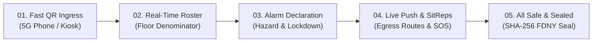

# 📑 Con Edison Floor 07 · MusterCommand Executive One-Pager

> **Facility**: Consolidated Edison Company of New York, Inc. · 4 Irving Place, New York, NY 10003  
> **Floor**: Floor 07 High-Rise Commercial Operations  
> **Jurisdiction & Compliance**: **NYC Fire Code 3 RCNY §401-06** (Fire Safety and Evacuation Plans & Certificates of Fitness)  
> **Classification**: Commercial High-Rise Life-Safety Operating System, Dynamic Ingress, Spatial Evacuation & Cryptographic Audit  

---

## 🎯 1. Executive Summary & The Core Operational Challenge

Standard commercial high-rise buildings rely on static turnstile access logs and physical paper muster clipboards during emergencies. This creates three life-threatening operational bottlenecks during active evacuations:

1. **The Phantom Denominator**: Fire Safety Directors (FSDs) do not know who is physically inside the building right now versus working remotely, visiting other floors, or out for lunch.
2. **Search-and-Rescue Guesswork**: First responders risk life and limb conducting blind sweeps of cleared zones because there is no verified real-time headcount closure.
3. **Audit & Compliance Failure**: Compiling post-drill reports takes days of manual correlation and lacks tamper-evident cryptographic proof for FDNY legal inspections.

**MusterCommand** solves this with a unified, browser-native life-safety operating system combining:
* Universal smartphone QR ingress (5G cellular Cloudflare tunnels without app installations),
* Live spatial CAD sector denominator accounting across NW, NE, SW, and SE quadrants,
* An immutable SHA-256 cryptographic audit ledger,
* An authorized **Warden Walkie-Talkie (PTT)** live distress radio broadcasting engine, and
* **Google Gemini 3.6 Flash** after-action intelligence.

---

## 🔄 2. The 5-Step Life-Safety Operational Lifecycle

| Step | Designation | Primary Operational Function |
| :---: | :--- | :--- |
| **01** | **Scan & Ingress** | Any smartphone on 5G cellular or local Wi-Fi scans official entrance posters to auto-account regular staff or onboard guests in under 10 seconds. Includes optical turnstile badge scanner simulation and real-time SHA-256 ingress event stream. |
| **02** | **Signed-In Floor Roster** | Establishes the exact live baseline denominator across NW, NE, SW, and SE sectors before any alarm is sounded. Dual view provides real-time CAD sector personnel cards or the cryptographic block ledger. |
| **03** | **Alarm & Directive Declaration** | Incident commander categorizes hazards (Fire, Gas Leak, Smoke, Drill) and triggers floor lockdown protocols with acoustic siren sweeps and live emergency status broadcasts. |
| **04** | **Emergency Push & SitReps** | Directives pushed to phones, SMS gateways, PA audio, and signage displays. Occupants transmit 1-tap SOS alerts, evac chair requests, and notes. Authorized Wardens transmit live Walkie-Talkie (PTT) distress voice broadcasts. |
| **05** | **All-Safe Headcount Closure** | Verifies 100% headcount closure (`195/195`), cryptographically seals the SHA-256 audit ledger, and generates the official FDNY 3 RCNY §401-06 Certificate of Compliance with FSD digital signature. |

---

## 🧠 3. How & What AI Does (Google Gemini 3.6 Flash)

The platform integrates **Google Gemini 3.6 Flash** via the `@google/genai` SDK for two life-safety capabilities built with mathematical zero-hallucination guardrails:

### Feature A: Hash-Grounded After-Action Narrative Generator (`/api/ai/drill-narrative`)
* **How It Works**: Ingests real-time muster telemetry (total present occupants, accounted safe, MIA exceptions, evacuation chairs requested) alongside the **raw cryptographic SHA-256 audit ledger blocks**.
* **What It Produces**:
  1. **Executive Summary**: High-level operational analysis of drill performance and muster compliance.
  2. **Chronological Timeline**: Explicitly grounded by referencing exact cryptographic ledger block IDs (e.g. `Block L-0001`, `Block L-0028`) to eliminate hallucinations.
  3. **Statistical Benchmarks**: Automated p95 muster duration benchmarks and time-to-all-safe metrics.
  4. **Exception Diagnostics**: Automated root-cause review of stairwell congestion, evac chair delays, or missing personnel.
  5. **Corrective Actions**: 3 actionable operational enhancements for future drills.
* **Resilient Architecture**: Equipped with automatic server-side fallback to guarantee that reports always generate cleanly during peak upstream demand or network interruptions.

### Feature B: Natural Language Red-List Query Engine (`/api/ai/redlist-query`)
* **How It Works**: Commanders type or speak plain English queries during an incident (e.g., *"Show me all contractors missing in the Northwest sector"* or *"Is anyone waiting for an evac chair in Stairwell A?"*).
* **Deterministic Guardrail**: Gemini translates the query into a structured query specification (`quadrant`, `status`, `minMinutesUnaccounted`, `isVisitor`, `needEvacChair`) and writes an executive briefing. The backend then deterministically filters the real database records, **guaranteeing 100% mathematical fidelity with zero hallucinations**.

---

## 🎙️ 4. Natural AI Voice Engine & Warden Walkie-Talkie (PTT) Radio

### Natural High-Clarity Voice Synthesizer
* **Commercial PA Chime**: Plays a synthesized harmonic two-tone chime (`E5 659.25Hz → A5 880Hz`) with smooth exponential decay prior to speaking, priming audio hardware and alerting occupants.
* **Natural Neural Voices**: Uses asynchronous voice caching (`speechSynthesis.onvoiceschanged`) to select natural human voices (*Google US English*, *Apple Samantha Enhanced*, *Microsoft Natural Neural*).
* **Phonetic Normalization**: Automatically expands emergency acronyms (`FSD` → *"Fire Safety Director"*, `Stair A` → *"Staircase Alpha"*, `ARA` → *"Area of Rescue Assistance"*, `p95` → *"95th percentile"*).
* **Articulate Cadence**: Calibrated rate to `0.94` and natural pitch to `0.98` for authoritative, calm emergency dispatch.

### Live Warden Walkie-Talkie (PTT) Distress Radio
* **Role-Restricted Transmitter**: Strictly gated to verified **Floor Wardens** (PIN: `2026`) and **FSD Chief Commanders** (PIN: `7007`). Unauthorized occupant devices or outsiders are blocked with `403 Forbidden`.
* **Industrial Push-to-Talk (PTT) Handset**: Press & Hold to Speak (or Hands-Free Latch), dynamic 20-segment LED VU audio level meter, key-up chirp (`playRadioPttChirp`), and roger beep (`playRadioRogerBeep`).
* **Live ADA Distress Transcription**: Words spoken by the warden are transcribed in real-time using Speech-to-Text and broadcast alongside audio so deaf and hard-of-hearing occupants can read the directive.
* **Instant Multi-Device Reception**: Broadcasts directly to all 195 occupant mobile portals via Server-Sent Events (SSE) and logs permanently into the SHA-256 ledger (`WARDEN_WALKIE_TALKIE_BROADCAST`).

---

## 💻 5. Enterprise Technology Stack Matrix

| Architectural Layer | Technologies | Primary Life-Safety Role |
| :--- | :--- | :--- |
| **Frontend UI** | **React 19**, **Vite 6**, **Tailwind CSS v4**, **Motion**, **Lucide** | Sub-16ms responsive Commander console and mobile web pass. |
| **Spatial Engine** | **HTML5 Canvas 2D**, Geofencing, Zone Matrix | 4-quadrant spatial coordinates, turnstile checkpoints, and designated Area of Rescue Assistance (ARA). |
| **Sensory & Audio** | **Web Audio API**, **WebRTC MediaDevices**, **MediaRecorder** | In-browser optical camera badge scanning, acoustic sirens, PA chime, and walkie-talkie PTT recording. |
| **Backend API** | **Node.js (v22+)**, **Express**, **TypeScript**, **esbuild** | Scalable microservice APIs, JSON schema validation, and digital signatures. |
| **Real-Time Bus** | **Server-Sent Events (SSE)** (`/api/stream`, `/api/sse`) | Sub-100ms real-time push synchronization across all connected smartphones, commander desks, and kiosks. |
| **Edge Ingress** | **Cloudflare Quick Tunnels** + 30s Health Watchdog | Instant public HTTPS URL for off-network 5G smartphones without corporate firewall or VPN friction. |
| **Cryptographic Ledger** | **Web Crypto API (SHA-256)** | Tamper-evident hash-chained blocks satisfying **NYC Fire Code §401-06**. |
| **AI Intelligence** | **Google Gemini 3.6 Flash** (`@google/genai`) | Hash-grounded After-Action reporting and natural language roster queries. |
| **Offline Resilience** | **IndexedDB Offline Queue**, LocalStorage Cache | Guarantees continuous badging and attendance recording during cellular/Wi-Fi collapse. |

---

## 🔐 6. Regulatory Compliance & Verification

* **NYC Fire Code Mandate**: Compliant with **3 RCNY §401-06** requirements for commercial high-rise fire safety and evacuation plan audits.
* **SHA-256 Ledger Sealing**: Every sign-in, alarm trigger, directive push, walkie-talkie transmission, and narrative approval appends a block linking to `prevHash`.
* **FSD Certificate of Fitness**: Produces an official tamper-evident compliance certificate upon reaching 100% headcount closure.
* **Publication PDF**: Compiled as a standalone printable document available at [`executive_one_pager.pdf`](file:///Users/samuelmcfarlane/Fsd%20console%205steps/fsd-remix-console/executive_one_pager.pdf).
